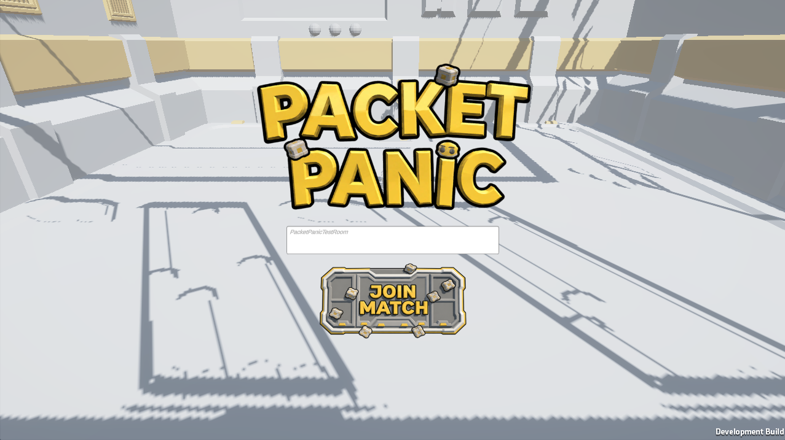
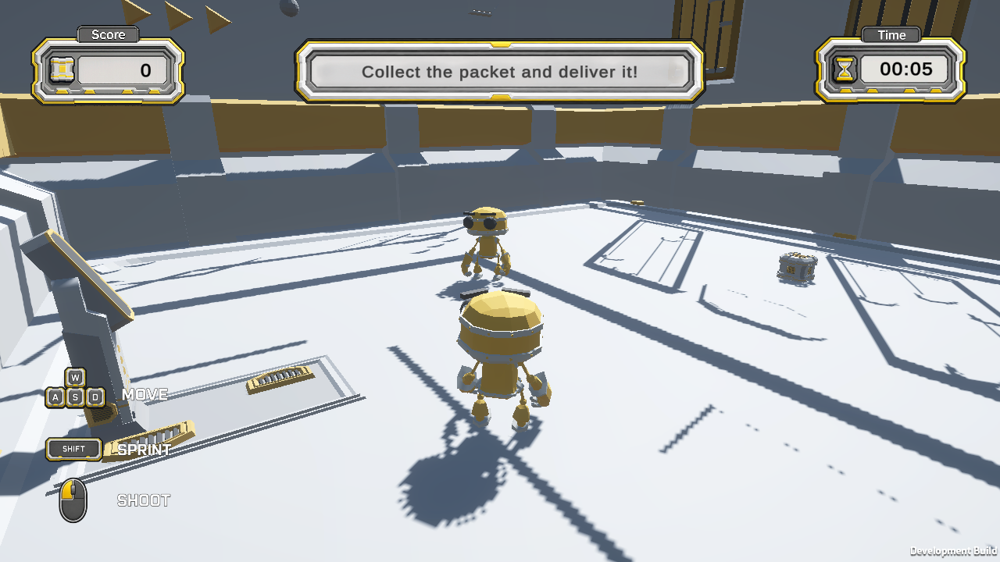
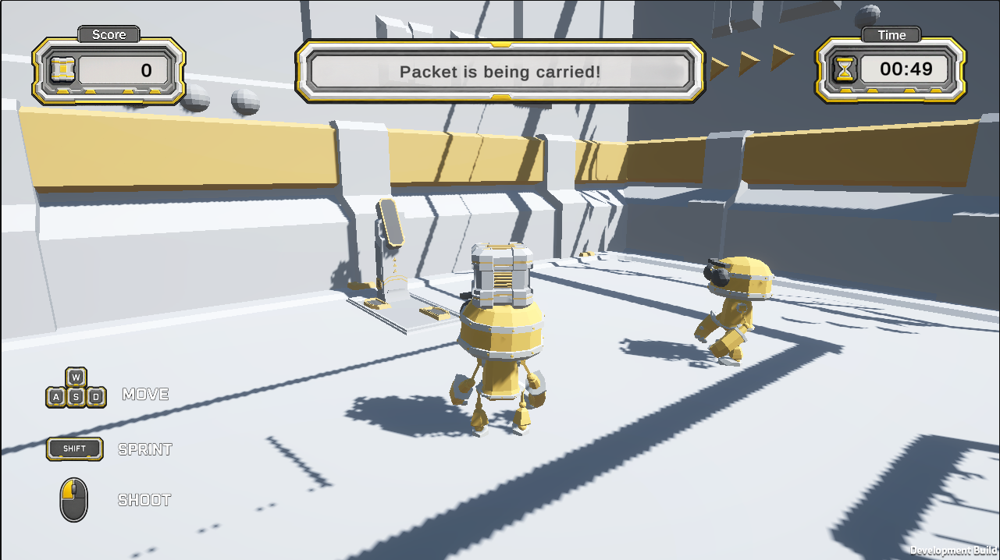
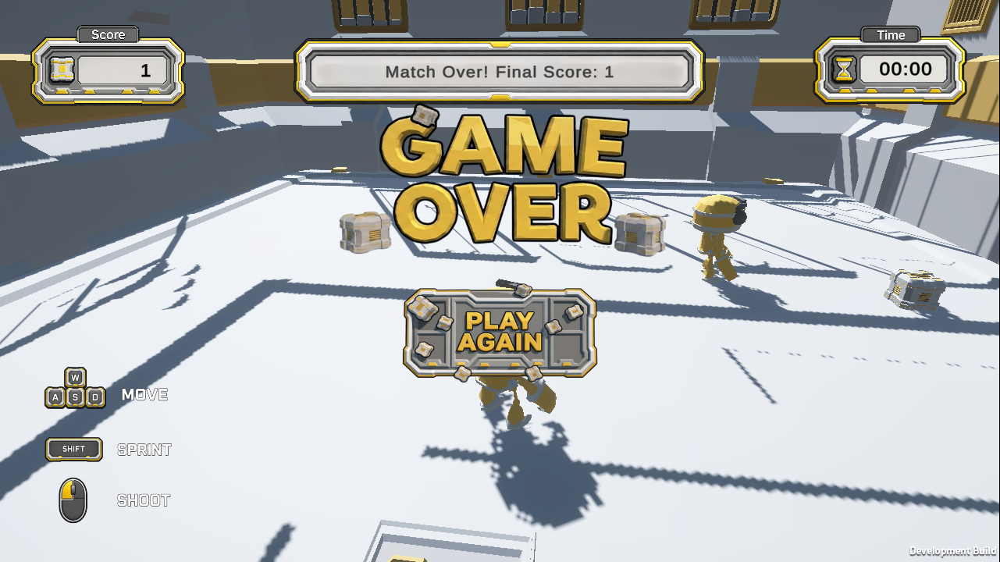

# Packet Panic: Relay Arena

Packet Panic: Relay Arena is a small 3D multiplayer WebGL arena game built in Unity using Photon Fusion.

Players compete to collect a shared data packet and deliver it to a relay base before time runs out. The opposing player can shoot the packet carrier to force a drop, creating a simple chase, steal, and deliver gameplay loop.

## Playable Demo

Playable WebGL build:  
https://saycheesexd.itch.io/packet-panic-relay-arena

## Demo Video

[Watch Gameplay Demo](https://youtu.be/ypY-vy6bhDg)

## Features

- Unity 3D arena gameplay
- Photon Fusion multiplayer using Shared Mode
- Room join menu
- Two-player synchronized gameplay
- Networked player spawning
- Synced player movement and animations
- Object-pooled projectile shooting
- Shared packet objective
- Packet drop on projectile hit
- Pickup cooldown after packet drop
- Shared score, timer, match state, and rematch flow
- WebGL browser build

## Controls

| Action | Input |
|---|---|
| Move | WASD |
| Sprint | Shift |
| Rotate Camera | Right Mouse Button |
| Zoom Camera | Mouse Wheel |
| Shoot | Left Mouse Button |

## Gameplay Loop

1. Join the same room from two browser windows or devices.
2. Collect the data packet.
3. Deliver it to the relay base to score.
4. Shoot the packet carrier to force a packet drop.
5. Pick up the dropped packet and steal the objective.
6. When time runs out, both players can restart with the Play Again button.

## Technical Details

### Multiplayer

The project uses Photon Fusion Shared Mode for multiplayer networking. Player objects are spawned through a Fusion player spawner, and each client controls its own player while remote players are synchronized across the network.

### Shared Game State

A networked game state object controls:

- Match timer
- Score
- Packet carrier
- Packet drop position
- Match phase
- Rematch reset

This ensures both clients see the same packet state, score, timer, and match result.

### Shooting

Projectiles are spawned using an object pooling system. Shooting is triggered through a Fusion RPC so projectile visuals appear across clients.

### WebGL

The project is prepared as a WebGL build for browser-based play. The game is optimized as a lightweight two-player multiplayer prototype.

## Screenshots

### Main Menu

### Multiplayer Arena

### Packet Carry

### Match Over

## Project Status

This is a portfolio prototype built to demonstrate:

- Unity C# gameplay programming
- Multiplayer networking with Photon Fusion
- WebGL deployment
- Object pooling
- Shared game-state synchronization
- Basic third-person arena mechanics

## Known Limitations

- Designed mainly for stable two-player matches
- Third-player WebGL testing may be performance-heavy on a single machine
- Visual polish is intentionally lightweight
- Gameplay is prototype-scale rather than full production-scale

## Built With

- Unity
- C#
- Photon Fusion
- WebGL